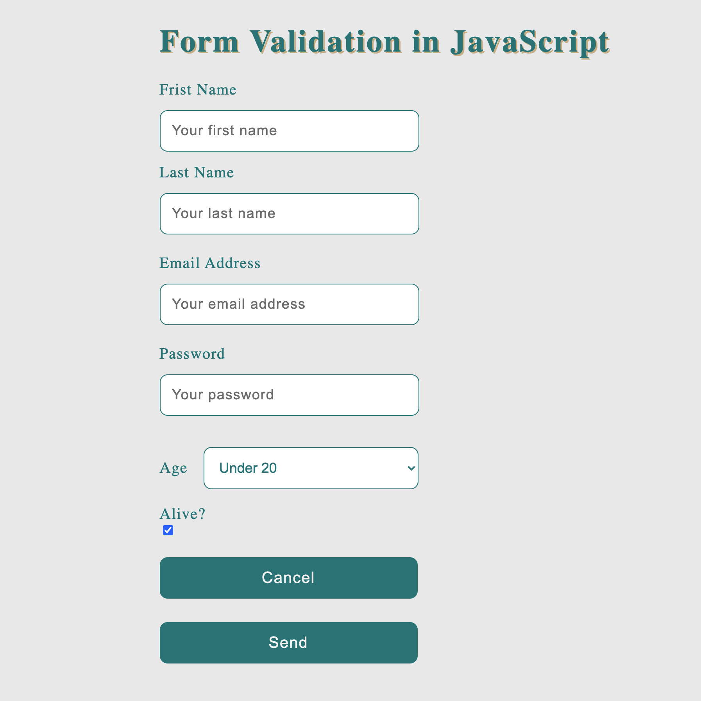

# GitHub Jobs App

---

### About:

This is a simple form validation in JavaScript where the input data is being processed if they meet the requirement. If anyone of them doesn't meet the criteria, it will be rejected and an error message will appear notifying to enter appropriate data.

Click here to see the App: https://alam1386.github.io/github-jobs/
## Technoloogies used:

- JavaScript
- CSS
- HTML
- Git

## Software used in this Project:

- Visual Studio Code
- GitHub
- Google Chrome Developer Tools

## How to use it:

- Download the code and run the index.html file in your browser.

## Developed by:

Alam Talash
https://alamtalash.com

#### Date: Feb 13, 2021, Burnaby, Ca
